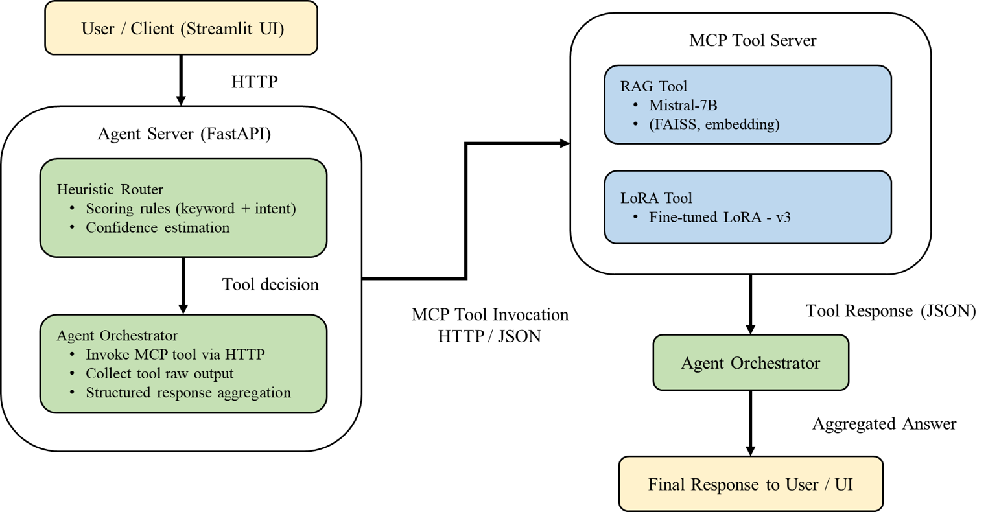
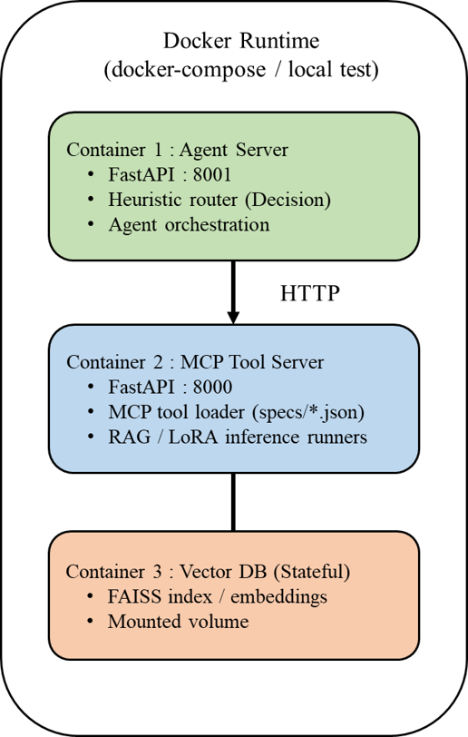
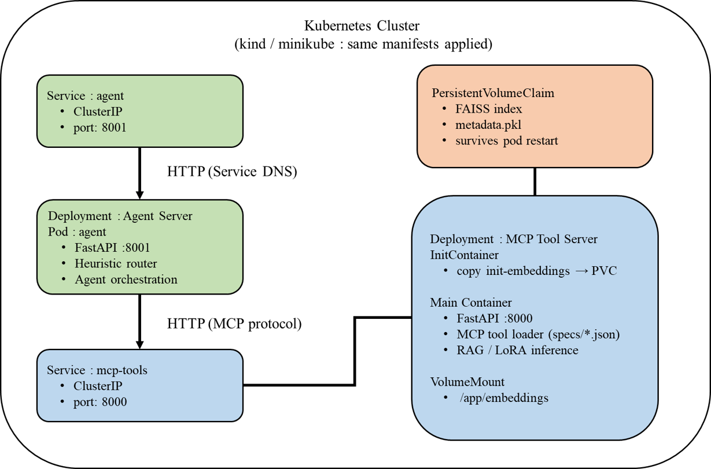

# Enterprise LLM Agent System with MCP-style Tool Orchestration

This repository demonstrates an enterprise-oriented LLM Agent system
designed to decouple reasoning, retrieval, and model inference using
MCP-style tool orchestration and service boundaries.

---

## System Overview

### Architecture

Key design principles:
- Agent is responsible for reasoning and tool selection only
- Tools are stateless, independently deployable services
- Vector state is externalized for consistent startup and scalability

---

## Core Components

### Agent Server
- Performs heuristic routing based on query intent
- Selects appropriate tools (RAG or fine-tuned LoRA-v3)
- Does not depend on tool internals
- Exposes a single unified API for downstream clients (UI / API)

### MCP-style Tool Servers
- RAG Tool Server (FAISS-based retrieval)
- SFT Tool Server (fine-tuned LoRA-v3 inference)
- Each tool is independently deployable and replaceable
- Communicate with the Agent via structured request/response contracts

---

## Routing Strategy

The Agent uses rule-based heuristic routing to determine:
- Whether to retrieve external knowledge
- Whether to use a fine-tuned internal model
- When multiple routes are applicable, the system defaults to RAG,
prioritizing factual consistency and safety over specialization.

Routing rules are configurable via YAML.

---

## Deployment

### Local Validation
- Docker Compose for multi-service validation

### Production-like Setup
- Kubernetes deployment
- Persistent Volumes for vector index and embeddings
- InitContainers ensure consistent tool initialization
- Designed to mirror production constraints and operational patterns

---

## Why This Design

This architecture addresses common enterprise LLM challenges:
- Tight coupling between logic and models
- Difficulty scaling heterogeneous tools
- Lack of clear service boundaries

By introducing an Agent layer and MCP-style Tool Servers, the system improves:
- Modularity
- Observability
- Maintainability

---

## Notes

- Model weights and proprietary data are intentionally excluded
- This repository focuses on system architecture and engineering design
- Optional UI demo implemented with Streamlit / simple frontend
